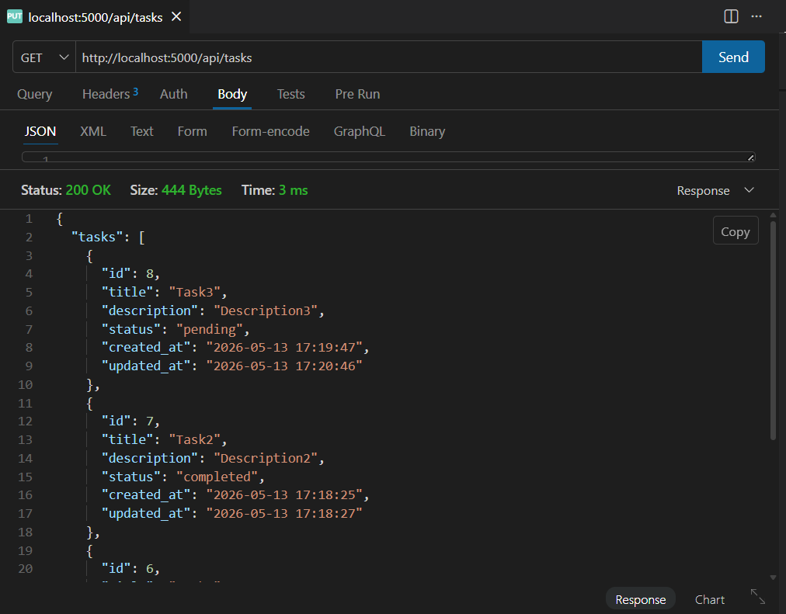
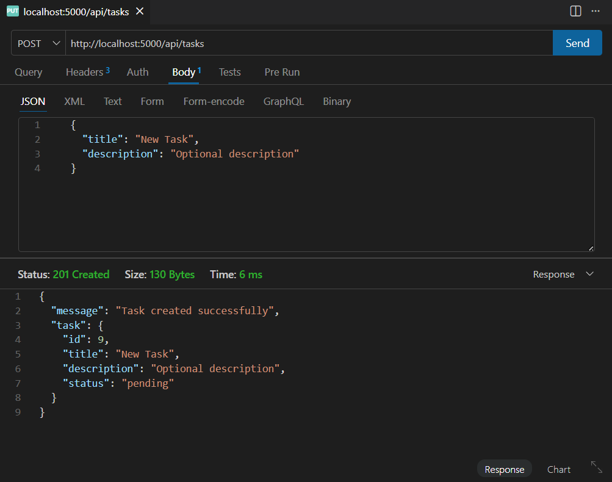
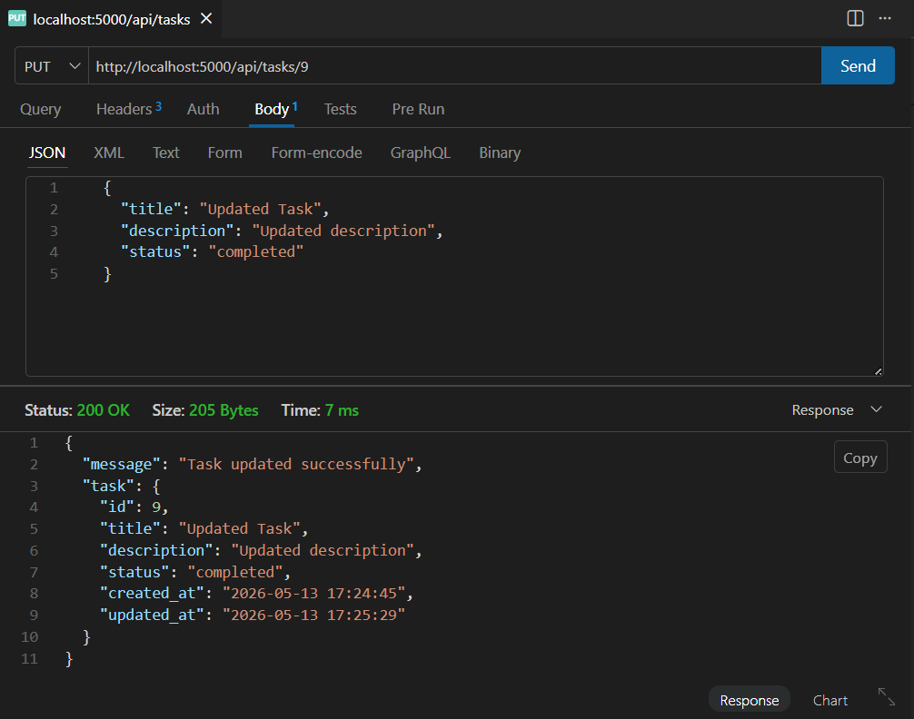
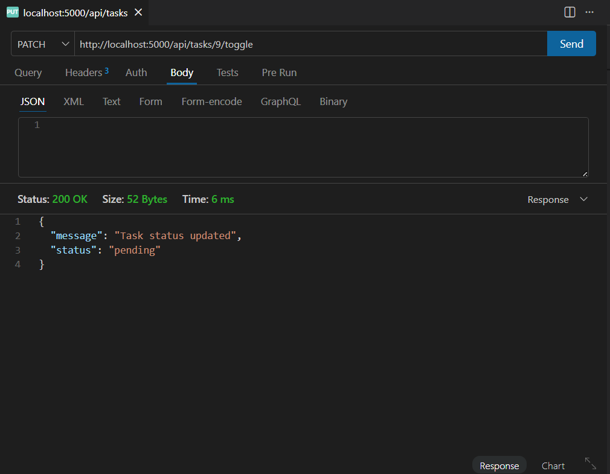
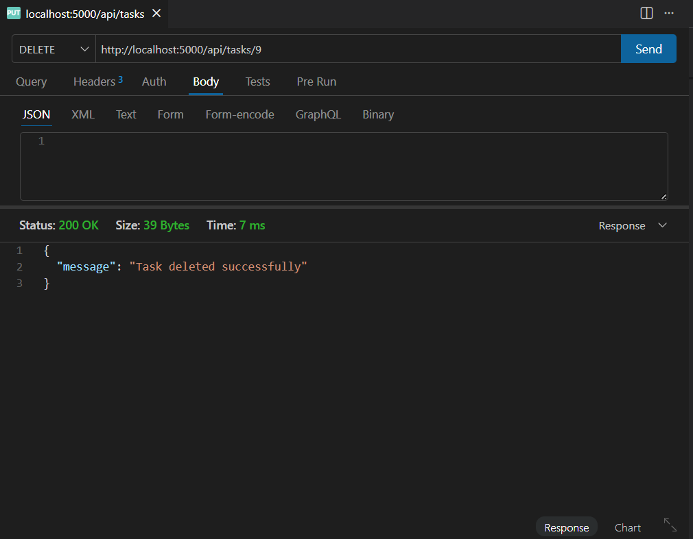

# Task-Flow

[](https://github.com/intiserIqbal/task-flow)
[](https://github.com/intiserIqbal/task-flow)
[](LICENSE)
[](https://nodejs.org/)
[](https://react.dev/)
[](https://www.sqlite.org/index.html)


**Task-Flow** is a mini full-stack personal task management app featuring a modern React frontend, robust Node.js/Express backend, and persistent SQLite storage. It supports CRUD operations, completion toggling, filtering, and a clean, responsive UI. Designed for clarity, stability, and ease of local setup.

---

## Demo Walkthrough

[](https://youtu.be/6mspoAPEvas)

---

## Table of Contents

- [Features](#features)
- [Tech Stack](#tech-stack)
- [Prerequisites](#prerequisites)
- [Local Setup](#local-setup)
- [Database Initialization](#database-initialization)
- [API Endpoints with Manual Test References](#api-endpoints-with-manual-test-references)
- [Project Structure (Partial)](#project-structurepartial)
- [What I used AI for](#what-i-used-ai-for)
- [Future Improvements](#future-improvements)
- [License](#license)
- [Contact](#contact)

---

## Features

- Create, edit, delete, and filter tasks
- Mark tasks as completed
- Inline editing and visual status cues
- Responsive UI with loading states
- Responsive layout for desktop and mobile devices
- RESTful API with validation and error handling

**Frontend and backend validation prevent empty task titles. Invalid API requests return proper HTTP 400 responses.**

---

## Tech Stack

| Layer     | Technology                      |
| --------- | ------------------------------- |
| Frontend  | React 19, Vite, Axios, ESLint   |
| Backend   | Node.js 20+, Express 5, sqlite3 |
| Database  | SQLite 3                        |
| Dev Tools | dotenv, cors, nodemon           |

---

## Prerequisites

- **Node.js** v20 or higher ([download](https://nodejs.org/))
- **npm** (comes with Node.js)
- **sqlite3** CLI (for manual DB seeding)

---

## Local Setup

1. **Clone the repository:**

```bash
git clone https://github.com/intiserIqbal/task-flow.git
cd task-flow
```

2. **Install dependencies:**

```bash
cd backend
npm install
cd ../frontend
npm install
```

3. **Configure environment variables:**

- Copy `.env.example` to `.env` in `backend/` if needed.
- `frontend/` currently does not hold any `.env` so no `.env.example` to copy to `.env`.
- Set `PORT` and `DB_PATH` in `backend/.env` (see `.env.example`).

---

## Database Initialization

The SQLite database is **automatically created** when the backend server starts for the first time.

**Database file location:**

```
backend/src/db/tasks.db
```

No manual migration or seeding is required. The app will work out of the box.

4. **Run the backend server:**

```bash
cd backend
npm run dev
```

5. **Run the frontend dev server:**

```bash
cd frontend
npm run dev
```

6. **Open the app and test:**

- Visit [http://localhost:5173](http://localhost:5173) in your browser. Then, perform custom tests to your liking.

---

## API Endpoints with Manual Test References

| Method | Endpoint                | Description       | Example Screenshot                                             |
| ------ | ----------------------- | ----------------- | -------------------------------------------------------------- |
| GET    | `/api/tasks`            | Get all tasks     |                   |
| POST   | `/api/tasks`            | Create a new task |                 |
| PUT    | `/api/tasks/:id`        | Update a task     |                 |
| PATCH  | `/api/tasks/:id/toggle` | Toggle completed  |  |
| DELETE | `/api/tasks/:id`        | Delete a task     |                   |

---

## Project Structure(Partial)

```
task-flow/
├── backend/
│   ├── package.json
│   ├── src/
│   │   ├── app.js
│   │   ├── controllers/
│   │   ├── db/
│   │   │   └── database.js
│   │   ├── middleware/
│   │   ├── models/
│   │   └── routes/
├── frontend/
│   ├── package.json
│   ├── vite.config.js
│   ├── src/
│   │   ├── App.jsx
│   │   ├── components/
│   │   ├── services/
│   │   └── styles/
│   └── public/
├── README-images/
│   └── manual API references
└── README.md
```

---

## What I used AI for

I used AI coding assistance tools such as ChatGPT (project-based guidance and scaffolding suggestions) and GitHub Copilot for small implementation snippets and refactoring support.

---

## Future Improvements

- Add due dates with overdue highlighting
- Add task priorities and sorting
- Add backend unit tests
- Deploy application

## License

[MIT License](LICENSE) — free to use, modify, and distribute with attribution.

---

## Contact

Open an issue on [GitHub](https://github.com/intiserIqbal/task-flow) or reach out via the repository's discussion tab.

---
